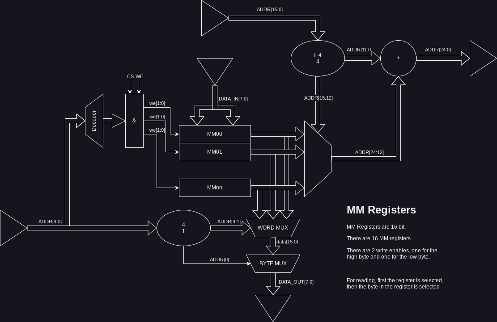

# Memory Mapper

## Overview

The memory mapper gives expands the CPU's address space from 16 bits to 25.
It can be expanded to be 28 bits, but only 25 are needed to access all of
sdram.

Its architecture is show below:

There are 32 16 bit registers: One for each 4k page in the virtual address
space. The memory mapper is always enabled, but at reset it is identity
mapped, i.e. register _n_ will be reset to value _n_.

## Interface

The Memory mapper is composed of 32 identical 16 bit mapping registers

The chip select should be calculated based on the virtual address. If not,
it will be possible for the CPU to map away access to the mapper, at which
point it is impossible to change the mappings without a reset.

## Registers

### Register Map

| Address 	| Read     	    | Write      	|
|---------	|-------------- |--------------	|
| 00       	| MM0 Low   	| MM0 Low       |
| 01       	| MM0 High  	| MM0 High      |
| 02       	| MM1 Low   	| MM1 Low       |
| 03       	| MM1 High  	| MM1 High      |
| 04       	| MM2 Low   	| MM2 Low       |
| 05       	| MM2 High  	| MM2 High      |
| 06       	| MM3 Low   	| MM3 Low       |
| 07       	| MM3 High  	| MM3 High      |
| 08       	| MM4 Low   	| MM4 Low       |
| 09       	| MM4 High  	| MM4 High      |
| 0A       	| MM5 Low   	| MM5 Low       |
| 0B       	| MM5 High  	| MM5 High      |
| 0C       	| MM6 Low   	| MM6 Low       |
| 0D       	| MM6 High  	| MM6 High      |
| 0E       	| MM7 Low   	| MM7 Low       |
| 0F       	| MM7 High  	| MM7 High      |
| 10       	| MM8 Low   	| MM8 Low       |
| 11       	| MM8 High  	| MM8 High      |
| 12       	| MM9 Low   	| MM9 Low       |
| 13       	| MM9 High  	| MM9 High      |
| 14       	| MM10 Low  	| MM10 Low      |
| 15       	| MM10 High 	| MM10 High     |
| 16       	| MM11 Low  	| MM11 Low      |
| 17       	| MM11 High 	| MM11 High     |
| 18       	| MM12 Low  	| MM12 Low      |
| 19       	| MM12 High 	| MM12 High     |
| 1A       	| MM13 Low  	| MM13 Low      |
| 1B       	| MM13 High 	| MM13 High     |
| 1C       	| MM14 Low  	| MM14 Low      |
| 1D       	| MM14 High 	| MM14 High     |
| 1E       	| MM15 Low  	| MM15 Low      |
| 1F       	| MM15 High 	| MM15 High     |

### MMn Low

Low memory map data. Becomes bits [19:12] of physical address.

### MMn High

High memory map data. Becomes bits [27:20] of physical address.