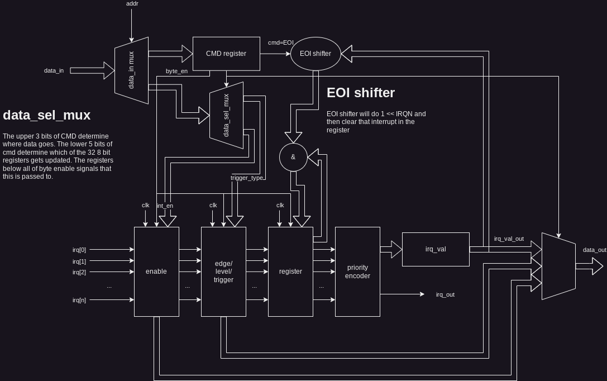

# PIC

## Overview

The PIC (Programmable Interrupt Controller) supports 256 edge or level
triggered interrupts.

Interrupts can only be rising edge or positive level trigger. Negative edge or
low level trigger can be accomplished by inverting the input to this module.

When an interrupt is triggered, it remains triggered until cleared with an
`EOI`. Currently, only the highest priority interrupt can be cleared. This
is bad design and will be fixed soon(tm).

## Interface

The PIC is controlled through two 8-bit registers, `CMD` and `DAT`.
The upepr 3 bits of `CMD` control which register is accessed, and the lower 5
bits control the byte select.

`EOI` is a special case: when `CMD` is 0xFF, the highest priority interrupt is
cleared.

### CMD
| [7:5]            	| [4:0]       	|
|------------------	|-------------	|
| Register Address 	| Byte Select 	|

### DAT
| [7:0]                 	|
|-----------------------	|
| Data[8*Byte_sel +: 8] 	|

## Registers

### Register Map

| Address 	| Read       	| Write  	|
|---------	|------------	|--------	|
| 0       	| IRQ Number 	| ~      	|
| 1       	| Enable     	| Enable 	|
| 2       	| Type       	| Type   	|

### IRQ Number

8 bit register outputs the highest priority interrupt currently active. When 
no interrupt is active, it will output 255.

### Enable

256 bit enable register. When bit _n_ is set to 1, the corresponding interrupt
_n_.

### Type

256 bit type register. When bit _n_ is set to 0, the corresponding interrupt
_n_ will be edge triggered. If the bit is set to 1, the interrupt will be level
triggered.