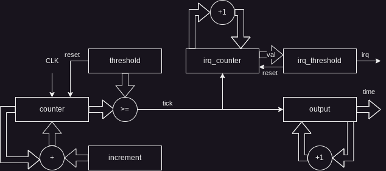

# RTC

## Overview

The RTC is capable of keeping track of elapsed time as well as generating
periodic interrupts. Its input frequency is (currently) the same as the CPU
frequency. The architecture is shown below:

The `counter` register is a 32 bit register which increments by `increment`
every clock tick. When this value reaches `threshold`, both `output` and
`irq_counter` are incremented by 1. When `irq_counter` reaches `irq_threshold`,
an interrupt is generated.

The interrupt frequency can be calculated with the following equations:

$$ F_{out}=\frac{F_{in}\cdot{increment}}{threshold} $$
$$ F_{irq}=\frac{F_{out}}{irq\_threshold} $$

Where $ F_{out} $ is the frequency at which the output changes and $ F_{irq} $
is the frequency at which interrupts occur.

## Interface

The RTC is controlled through two 8-bit registers, `CMD` and `DAT`.
The upepr 4 bits of `CMD` control which register is accessed, and the lower 4
bits control the byte select. The RTC uses 32 bit registers, so only values of
0-3 are supported.

### CMD
| [7:4]            	| [3:2     	| [1:0]       	|
|------------------	|----------	|-------------	|
| Register Address 	| Reserved 	| Byte Select 	|

### DAT
| [7:0]                 	|
|-----------------------	|
| Data[8*Byte_sel +: 8] 	|

## Registers

### Register Map

| Address 	| Read          	| Write         	|
|---------	|---------------	|---------------	|
| 0       	| Threshold     	| Threshold     	|
| 1       	| Increment     	| Increment     	|
| 2       	| IRQ Threshold 	| IRQ Threshold 	|
| 3       	| Output        	| Control       	|

### Threshold

32 bit threshold register. When `counter` reaches this value, `output` and
`irq_counter` are incremented by 1, and `counter` is reset back to 0.

### Increment

32 bit increment register. Every clock cycle, `counter` is incremented by
`increment`

### IRQ Threshold

32 bit IRQ threshold register. When `irq_counter` reaches this value, and IRQ
is generated and `irq_counter` is reset back to 0.

### Output

32 bit output register. This value ticks up.

### Control

| [7:2]    	| [1]        	| [0]    	|
|----------	|------------	|--------	|
| Reserved 	| IRQ Enable 	| Enable 	|

8 bit Control register. Regardless of Byte Select, any write to address 3 will
write to this register. `IRQ Enable` controls interrupt generation. `Enable` is
a global enable. When 0, all counter registers are set to 0.

