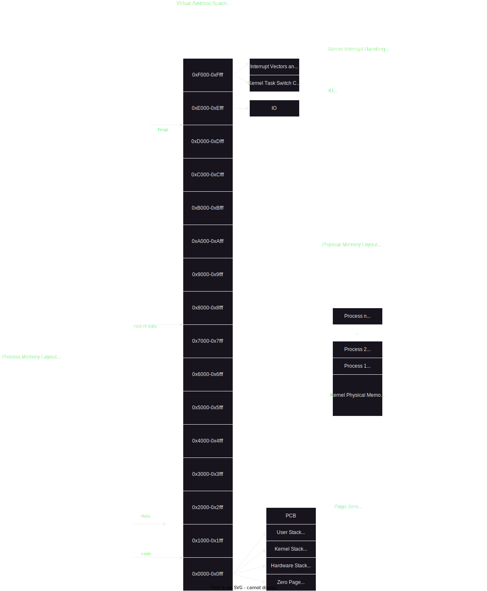

# Physical Memory Management

Physical memory will be handled in 4kb chunks. Each of these chunks needs to
be managed somehow.

We need a way for each PID to correspond with a list of memory mappings that
need to be loaded in.

In the ultra simple case. We don't assign memory dynamically and the mappings
are completely dependent on the PID. This is the easy case, allows only for
1022 processes at once.

The physical memory mapping then depends on the PID, where the base address of
any process is $$ (PID + 1) * 65536 $$

For minimum proof of concept, we can roll with this for now.

In the future, I would only like to assign a minimum of 8 blocks to a process,
and any dynamically allocated blocks would come after that.

